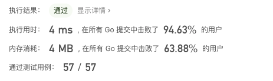

***
>
给定一个整数数组 nums 和一个整数目标值 target，请你在该数组中找出 和为目标值 target  的那 两个 整数，并返回它们的数组下标。

你可以假设每种输入只会对应一个答案。但是，数组中同一个元素在答案里不能重复出现。

你可以按任意顺序返回答案。


**示例 1：**
```
输入：nums = [2,7,11,15], target = 9
输出：[0,1]
解释：因为 nums[0] + nums[1] == 9 ，返回 [0, 1] 。
```
**示例 2：**
```
输入：nums = [3,2,4], target = 6
输出：[1,2]
```
**示例 3：**
```
输入：nums = [3,3], target = 6
输出：[0,1]
```

## 题解
- 用map临时做缓存

```go
func twoSum(nums []int, target int) []int {
    numMap := make(map[int]int,len(nums))
    for index,num := range nums {
        if indexMap,ok := numMap[target - num]; ok {
            return []int{indexMap, index}
        }
        numMap[num] = index
    }
    return nil
}
```
使用map存储检查过的数字,key: 数字 val:数字在切片中的位置下标.

**执行结果**


